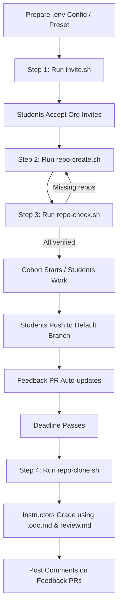
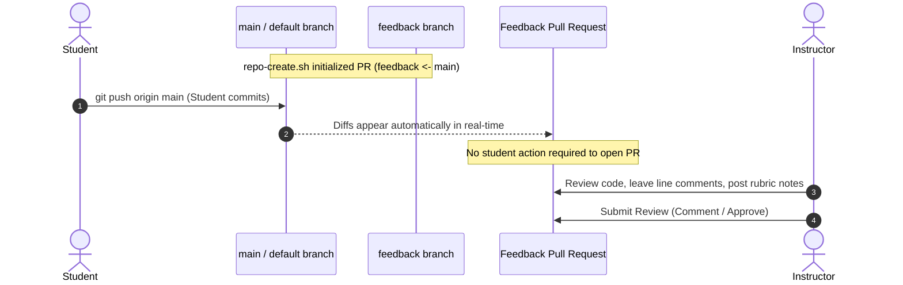

# End-to-End Guide: Classroom Tandingan Automation Suite

This guide provides an end-to-end walkthrough for educators, instructors, teaching assistants (TAs), and curriculum leads using `classroom-tandingan`. It covers the entire lifecycle of an academic cohort—from organization and environment configuration to student invitations, repository provisioning, assignment submission, pull request feedback, and bulk grading.

---

## Table of Contents

1. [System Overview & Architecture](#1-system-overview--architecture)
2. [Prerequisites & Organization Setup](#2-prerequisites--organization-setup)
3. [Configuration & Environment Presets](#3-configuration--environment-presets)
4. [End-to-End Workflow](#4-end-to-end-workflow)
   - [Step 1: Student Organization Onboarding (`scripts/invite.sh`)](#step-1-student-organization-onboarding-scriptsinvitesh)
   - [Step 2: Bulk Repository Provisioning (`scripts/repo-create.sh`)](#step-2-bulk-repository-provisioning-scriptsrepo-createsh)
   - [Step 3: Repository Verification (`scripts/repo-check.sh`)](#step-3-repository-verification-scriptsrepo-checksh)
   - [Step 4: Student Submission & Feedback PR Flow](#step-4-student-submission--feedback-pr-flow)
   - [Step 5: Post-Deadline Cloning & Grading (`scripts/repo-clone.sh`)](#step-5-post-deadline-cloning--grading-scriptsrepo-clonesh)
5. [Troubleshooting & Operational FAQs](#5-troubleshooting--operational-faqs)
6. [Safety & Automation Guardrails](#6-safety--automation-guardrails)

---

## 1. System Overview & Architecture

`classroom-tandingan` provides a lightweight, CLI-driven automation suite built directly on the official GitHub CLI (`gh`). It acts as a transparent, scriptable alternative to GitHub Classroom, giving instructors complete control over repository naming, teams, milestone deadlines, reviewer access, and automated feedback pull requests.

### Cohort Lifecycle Workflow



### Script Execution Sequence

| Order | Script | Target Operation | Primary Effect |
| :--- | :--- | :--- | :--- |
| **1** | [`scripts/invite.sh`](../scripts/invite.sh) | GitHub Organization & Teams | Ensures team exists and sends org invitations with team membership |
| **2** | [`scripts/repo-create.sh`](../scripts/repo-create.sh) | GitHub Repositories | Creates student repos from templates, sets deadlines, and initializes feedback PRs |
| **3** | [`scripts/repo-check.sh`](../scripts/repo-check.sh) | Verification & Audit | Audits expected repos against GitHub API to catch missing repos before launch |
| **4** | [`scripts/repo-clone.sh`](../scripts/repo-clone.sh) | Local Workspace & Grading | Clones repos locally and generates `todo.md` and `review.md` grading files |

---

## 2. Prerequisites & Organization Setup

### 2.1 GitHub CLI (`gh`) Setup

1. **Install `gh`**:
   - macOS (Homebrew): `brew install gh`
   - Linux / Windows: Refer to the [GitHub CLI manual](https://cli.github.com/manual/).

2. **Authenticate with required permissions**:
   The scripts interact with organization teams, secret memberships, and private repository administration. Run:
   ```bash
   gh auth login -s admin:org,repo,workflow
   ```

3. **Verify active user and scopes**:
   ```bash
   gh auth status
   ```
   Ensure your authenticated user has **Owner** or **Admin** privileges in the target GitHub Organization.

### 2.2 GitHub Organization Configuration

Before provisioning repositories:
- The target GitHub Organization must exist (e.g. `octo-academy`).
- Under Organization Settings -> **Member Privileges**:
  - **Base permissions**: Set to `None` or `Read` (the script explicitly grants `write` access to each student on their own repository).
  - **Repository creation**: Can be restricted to organization owners.

---

## 3. Configuration & Environment Presets

Configurations can be organized modularly per cohort, class, or assignment set.

### 3.1 Modular Configuration Files

You can create environment files matching your cohort naming convention:

* `.env.<COHORT_NAME>` (e.g. `.env.cohort-2026`, `.env.class-alpha`)
* `.env.<COHORT_NAME>-Set-<NUMBER>` (e.g. `.env.cohort-2026-Set-1`, `.env.cohort-2026-Set-2`)

> [!NOTE]
> All `.env*` files containing cohort names, student lists, or tokens are gitignored to protect student privacy. Never commit live presets to version control.

### 3.2 Configuration Variables Reference

Each configuration file defines the following variables:

```bash
# Target GitHub Organization name
ORG="octo-academy"

# Batch or class identifier (included in repository names)
BATCH_NAME="cohort-2026"

# GitHub Team name inside the organization
TEAM_NAME="students-group-a"

# List of student GitHub usernames (space-separated or array elements)
USERS=(
    "studentOne"
    "studentTwo"
    "studentThree"
)

# List of instructors/TAs who review code and receive PR review requests
REVIEWERS=(
    "instructorLead"
    "teachingAssistantA"
)

# Template repositories and optional deadlines
# Format: "organization/templateRepo|YYYY-MM-DD HH:MM"
TEMPLATES=(
    "octo-academy/assignment-1|2026-10-15 23:59"
    "octo-academy/assignment-2|2026-10-22 23:59"
)
```

### 3.3 Deadline Formatting & Timezone Parsing

The `TEMPLATES` array accepts an optional deadline after a pipe (`|`) delimiter.
- The deadline format is: `YYYY-MM-DD HH:MM`.
- `scripts/repo-create.sh` parses this string, converts it to an ISO 8601 UTC timestamp (`YYYY-MM-DDTHH:MM:00Z`), and creates a milestone and reminder issue.
- If no deadline is specified, the script skips milestone and reminder issue creation.

---

## 4. End-to-End Workflow

Follow these steps sequentially for each cohort kickoff.

---

### Step 1: Student Organization Onboarding (`scripts/invite.sh`)

Inviting students to the organization ensures they have identity mapping and team access before repositories are provisioned.

#### Syntax
```bash
./scripts/invite.sh [COHORT_NAME] [SET_NUMBER]
```

#### Example
```bash
chmod +x scripts/invite.sh
./scripts/invite.sh cohort-2026 1
```

#### What Happens Behind the Scenes:
1. Loads `.env.cohort-2026-Set-1` (or fallback `.env.cohort-2026`).
2. Queries `orgs/$ORG/teams/$TEAM_NAME`. If the team does not exist, creates it with `privacy="secret"`.
3. Iterates over each user in `USERS`:
   - Calls `PUT /orgs/$ORG/teams/$TEAM_SLUG/memberships/$USER` with role `member`.
   - Sends an organization invitation if the user is not yet an org member.
   - Assigns them directly to the target team.

> [!IMPORTANT]
> **Action required by students**: Students must accept their GitHub Organization invitation via email or at `https://github.com/orgs/<ORG>/invitation` before repository permissions can bind cleanly.

---

### Step 2: Bulk Repository Provisioning (`scripts/repo-create.sh`)

Provisions individual student repositories from template repositories, attaches deadlines, sets collaborator permissions, and initializes the feedback pull request.

#### Syntax
```bash
./scripts/repo-create.sh [COHORT_NAME] [SET_NUMBER]
```

#### Example
```bash
chmod +x scripts/repo-create.sh
./scripts/repo-create.sh cohort-2026 1
```

#### Repository Naming Standard
Every provisioned repository follows a strict deterministic naming pattern:
```
<REPO_BASENAME>-<BATCH_NAME>-<USERNAME>
```
*Example*: If template is `octo-academy/assignment-1`, batch is `cohort-2026`, and student is `studentOne`, the repository name will be:
```
assignment-1-cohort-2026-studentOne
```

#### Provisioning Sequence for Each Repository:
1. **Repository Generation**:
   Calls `gh api -X POST /repos/$TEMPLATE_REPO/generate` to create a private repository inside `$ORG`.
2. **Deadline Milestone & Issue**:
   - Converts the deadline to ISO 8601 UTC.
   - Creates a milestone titled `"Assignment Deadline"`.
   - Creates an issue titled `"Assignment Deadline Reminder"` referencing the milestone and instructions.
3. **Collaborator Permission Mapping**:
   - Grants the student `write` access.
   - Grants all users listed in `REVIEWERS` `maintain` access.
4. **Automated Feedback Pull Request Setup**:
   - Clones a bare reference of the repository to a temporary workspace.
   - Creates an orphan or starting branch named `feedback` identical to the template's initial commit.
   - Adds `.github/FEEDBACK_HINT.md` explaining how the feedback PR works.
   - Pushes the `feedback` branch to the remote repository.
   - Opens a Pull Request titled `"Feedback"` with `base: feedback` and `head: main` (or the default branch).
   - Automatically requests reviews on this PR from all usernames in `REVIEWERS`.

---

### Step 3: Repository Verification (`scripts/repo-check.sh`)

Always verify repository creation before announcing the assignment to students.

#### Syntax
```bash
./scripts/repo-check.sh [COHORT_NAME] [SET_NUMBER]
```

#### Example
```bash
chmod +x scripts/repo-check.sh
./scripts/repo-check.sh cohort-2026 1
```

#### Output Example:
```text
==========================================
Starting Repository Existence Check
Users: studentOne studentTwo studentThree
Batch: cohort-2026
==========================================
##########################################
TEMPLATE: octo-academy/assignment-1
##########################################
[CREATED]     octo-academy/assignment-1-cohort-2026-studentOne
[CREATED]     octo-academy/assignment-1-cohort-2026-studentTwo
[NOT CREATED] octo-academy/assignment-1-cohort-2026-studentThree

==========================================
Summary
==========================================
Total Repositories Checked: 3
Created: 2
Not Created: 1
------------------------------------------
Created Repositories:
  - octo-academy/assignment-1-cohort-2026-studentOne
  - octo-academy/assignment-1-cohort-2026-studentTwo
Not Created Repositories:
  - octo-academy/assignment-1-cohort-2026-studentThree
==========================================
```

If any repository fails or reports `[NOT CREATED]`, check the username or re-run `repo-create.sh` (existing repositories will not be duplicated or damaged).

---

### Step 4: Student Submission & Feedback PR Flow

No manual pull request creation is needed from students!



1. **Student Workflow**:
   - The student clones their assigned repository:
     ```bash
     git clone https://github.com/octo-academy/assignment-1-cohort-2026-studentOne.git
     ```
   - The student works and commits directly to `main` (or default branch) and pushes:
     ```bash
     git push origin main
     ```
2. **Review Synchronization**:
   - Because the Feedback PR compares `feedback` to `main`, every push to `main` is automatically reflected in the PR diff.
   - Instructors and TAs can review progress before the deadline or conduct final code reviews directly on the PR.

---

### Step 5: Post-Deadline Cloning & Grading (`scripts/repo-clone.sh`)

Once the assignment deadline has passed, use `scripts/repo-clone.sh` to clone all student repositories locally and generate grading tracking sheets.

#### Syntax
```bash
./scripts/repo-clone.sh [COHORT_NAME] [SET_NUMBER]
```

#### Example
```bash
chmod +x scripts/repo-clone.sh
./scripts/repo-clone.sh cohort-2026 1
```

#### Generated Directory Structure:
```text
cloned/output/
├── assignment-1-cohort-2026-studentOne/      # Cloned student repo
├── assignment-1-cohort-2026-studentTwo/      # Cloned student repo
├── todo.md                                  # Grading tracking checklist
└── review.md                                # Structured rubric review notes
```

#### Generated Grading Artifacts:

1. **`cloned/output/todo.md`**:
   A checklist tracking grading completion for each student:
   ```markdown
   # Todo - Grading:

   [ ] studentOne
   [ ] studentTwo
   [ ] studentThree
   ```

2. **`cloned/output/review.md`**:
   Standardized evaluation template ready to copy into your LMS or the student's Feedback PR:
   ```markdown
   # studentOne

   ## Review

   ## Key Highlights

   ## What can be Improved?

   ===

   # studentTwo

   ## Review

   ## Key Highlights

   ## What can be Improved?

   ===
   ```

---

## 5. Troubleshooting & Operational FAQs

### Issue 1: "Could not resolve to a User with the login of '...'"
- **Cause**: Student GitHub username has a typo or the account does not exist.
- **Solution**: Check username spelling in your `.env` file and re-run.

### Issue 2: "User is not a member of the organization" when adding collaborator
- **Cause**: The student has not yet accepted the organization invitation.
- **Solution**:
  1. Ask the student to visit `https://github.com/orgs/<ORG>/invitation` and accept.
  2. Re-run `./scripts/repo-create.sh [COHORT_NAME] [SET_NUMBER]`. The script safely skips existing repositories and applies collaborator permissions to previously pending users.

### Issue 3: GitHub API Secondary Rate Limit
- **Cause**: Creating many repositories rapidly can trigger GitHub's anti-abuse rate limits.
- **Solution**:
  - The script introduces pauses between API calls. If an abuse rate limit triggers, wait 60 seconds and re-run.
  - Already-created repositories will fail creation gracefully with "Repository already exists" and proceed to ensure permissions and PRs.

### Issue 4: `repo-clone.sh` skips existing folders
- **Behavior**: If `cloned/output/<repo-folder>` already exists, `repo-clone.sh` skips re-cloning to avoid overwriting local instructor notes or test runs.
- **Solution**:
  - To pull latest student commits on already-cloned repos:
    ```bash
    for d in cloned/output/*/; do (cd "$d" && git pull); done
    ```
  - To force a fresh clone, delete or rename `cloned/output/`.

---

## 6. Safety & Automation Guardrails

When collaborating with AI agents or running automated pipelines:

1. **Explicit Approval for Mutations**:
   - **Never** allow automated bots or scripts to run `scripts/invite.sh` or `scripts/repo-create.sh` without manual human confirmation of the target organization, batch name, and student list.
2. **Credential Security**:
   - Never commit `.env` or any `.env.*` files into version control.
   - Always run `gh auth status` before executing scripts to ensure you are operating under the correct GitHub profile.
3. **Template Repository Permissions**:
   - Ensure template repositories are configured as **Template repositories** in GitHub repo settings (Settings -> General -> Template repository checkbox enabled).
